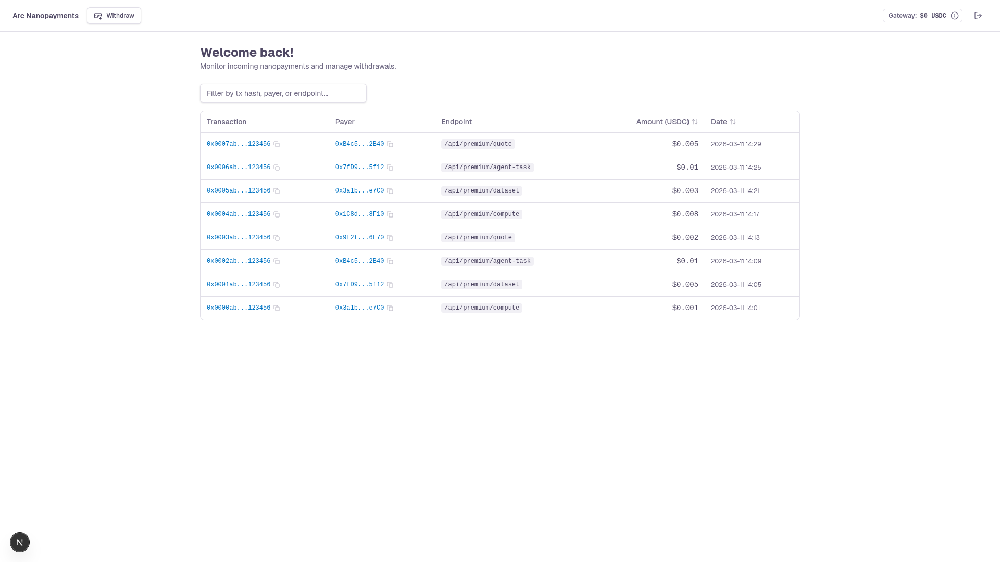

# Arc Nanopayments

Demonstrate gasless USDC nanopayments using [Circle Nanopayments](https://www.circle.com/nanopayments) on Arc. A **payment agent script** acts as the buyer, paying for paywalled resources in a loop, while a **Next.js web app** acts as the seller, exposing x402-protected endpoints and providing a seller dashboard to monitor payments and withdraw earnings.

Circle Gateway batches many signed offchain authorizations into a single onchain settlement, enabling economically viable sub-cent payments.



## Table of Contents

- [Prerequisites](#prerequisites)
- [Getting Started](#getting-started)
- [How It Works](#how-it-works)
- [Paywalled Endpoints](#paywalled-endpoints)
- [Seller Dashboard](#seller-dashboard)
- [Environment Variables](#environment-variables)
- [Demo Credentials](#demo-credentials)
- [Testing](#testing)
- [Security & Usage Model](#security--usage-model)

## Prerequisites

- **Node.js v22+** — Install via [nvm](https://github.com/nvm-sh/nvm)
- **Docker Desktop** — Runs Supabase locally. [Install Docker Desktop](https://www.docker.com/products/docker-desktop/)

## Getting Started

1. Clone the repository and install dependencies:

   ```bash
   git clone git@github.com:akelani-circle/arc-nanopayments.git
   cd arc-nanopayments
   npm install
   ```

2. Set up environment variables:

   ```bash
   cp .env.example .env.local
   ```

   Then edit `.env.local` and fill in all required values (see [Environment Variables](#environment-variables) section below).

3. Generate seller and buyer wallets:

   ```bash
   npm run generate-wallets
   ```

   This creates two EVM wallets (seller and buyer) and writes the seller address and both private keys to `.env.local`. It also adds a random `SESSION_SECRET` (used to sign dashboard sessions) if you do not have one yet. Follow the on-screen instructions to fund the buyer wallet with testnet USDC via the [Circle faucet](https://faucet.circle.com/).

4. Start the local Supabase instance (requires Docker Desktop running):

   ```bash
   npx supabase start
   npx supabase migration up
   ```

   The output of `npx supabase start` will display the Supabase URL and API keys needed for your `.env.local`.

5. Start the development server:

   ```bash
   npm run dev
   ```

   The app will be available at `http://localhost:3000`.

6. Run the payment agent:

   ```bash
   npm run agent
   ```

   The agent creates a throwaway wallet, funds it with gas and USDC from the buyer wallet, deposits `DEPOSIT_AMOUNT` USDC into Gateway, and then pays the x402-protected endpoints in turn, about once per second, on Arc Testnet. It tops up Gateway when the balance drops below 0.5 USDC.

   To set a USDC spending limit, use the `--limit` flag. The agent will pause when the limit is reached and prompt for additional allowance:

   ```bash
   npm run agent -- --limit 0.5
   ```

## How It Works

- Built with [Next.js](https://nextjs.org/) App Router and [Supabase](https://supabase.com/)
- Uses the [x402 protocol](https://www.x402.org/) for HTTP 402 nanopayments with USDC on the [Arc Network](https://arc.circle.com/)
- Uses [Circle's x402 batching SDK](https://www.npmjs.com/package/@circle-fin/x402-batching) (`GatewayClient`) for gasless payment facilitation
- Includes a payment agent script that uses `GatewayClient` to deposit USDC into Gateway and pay x402-protected resources
- Dashboard sessions are signed with `SESSION_SECRET`, and the seller APIs require one
- Seller dashboard with real-time payment monitoring, Gateway balance display, and cross-chain withdrawal support
- Payment events and withdrawals are persisted to Supabase with real-time subscriptions
- Styled with [Tailwind CSS](https://tailwindcss.com) and components from [shadcn/ui](https://ui.shadcn.com/)

## Paywalled Endpoints

The seller exposes several x402-protected API routes at different price points:

| Endpoint | Method | Price (USDC) | Description |
| --- | --- | --- | --- |
| `/api/premium/quote` | GET | $0.001 | Returns a premium inspirational quote |
| `/api/premium/dataset` | GET | $0.01 | Returns a small JSON analytics dataset |
| `/api/premium/compute` | POST | $0.0003 | Performs text analysis on submitted content |
| `/api/premium/agent-task` | GET | $0.03 | Returns a clue/step for a treasure hunt task |

Each endpoint returns `402 Payment Required` for unpaid requests. The buyer agent automatically signs the authorization and retries with the payment signature to receive the content.

## Seller Dashboard

The dashboard at `/dashboard` provides:

- **Gateway Balance** — Top-bar badge showing the seller's available Gateway balance, with a detail dialog for total, withdrawing, withdrawable, and wallet USDC balances
- **Payments Table** — Real-time list of incoming nanopayments with filtering and sorting, linked to [Arc Testnet Explorer](https://testnet.arcscan.app)
- **Withdraw Dialog** — Withdraw available USDC from Gateway to a wallet address on any supported testnet chain (Arc Testnet, Base Sepolia, Ethereum Sepolia, Arbitrum Sepolia, Optimism Sepolia, Avalanche Fuji, Polygon Amoy)

## Environment Variables

Copy `.env.example` to `.env.local` and fill in the required values:

```bash
# Supabase
NEXT_PUBLIC_SUPABASE_URL=your-project-url
NEXT_PUBLIC_SUPABASE_PUBLISHABLE_KEY=your-publishable-key
SUPABASE_SECRET_KEY=your-secret-key

# x402 / Circle Nanopayments
SELLER_ADDRESS=0xYourWalletAddress
SELLER_PRIVATE_KEY=0xYourSellerPrivateKey

# Signs dashboard sessions (16+ characters)
SESSION_SECRET=your-long-random-secret

# Buyer wallet (funds the payment agent)
BUYER_PRIVATE_KEY=0xYourBuyerPrivateKey

# Payment agent (optional)
# BASE_URL=http://localhost:3000
# DEPOSIT_AMOUNT=1
```

| Variable | Scope | Purpose |
| --- | --- | --- |
| `NEXT_PUBLIC_SUPABASE_URL` | Public | Supabase project URL. |
| `NEXT_PUBLIC_SUPABASE_PUBLISHABLE_KEY` | Public | Supabase publishable key. |
| `SUPABASE_SECRET_KEY` | Server-side | Supabase secret key, used to record payment events and withdrawals. |
| `SELLER_ADDRESS` | Server-side | EVM wallet address for receiving USDC payments. |
| `SELLER_PRIVATE_KEY` | Server-side | Seller wallet private key, used for Gateway balance queries and withdrawals. |
| `SESSION_SECRET` | Server-side | Signs dashboard session cookies. Required to sign in; 16+ random characters. |
| `BUYER_PRIVATE_KEY` | Agent | Buyer wallet private key. The agent uses it to fund its throwaway wallet. |
| `BASE_URL` | Agent | Optional. Base URL of the seller app. Defaults to `http://localhost:3000`. |
| `DEPOSIT_AMOUNT` | Agent | Optional. USDC amount moved into Gateway on each deposit. Defaults to `1`. |

> **Tip:** Run `npm run generate-wallets` to auto-generate `SELLER_ADDRESS`, `SELLER_PRIVATE_KEY`, `BUYER_PRIVATE_KEY` and `SESSION_SECRET`.

## Demo Credentials

The app uses a hardcoded demo account for local development:

| Email | Password |
| --- | --- |
| `admin@example.com` | `123456` |

## Testing

- `npm test` runs the unit tests in `tests/unit`. They mock Supabase and the Circle SDKs, so they need no credentials or Docker.
- `npm run test:integration` runs `tests/integration` against the local Supabase stack.

## Security & Usage Model

This sample application:
- Assumes testnet usage only
- Handles secrets via environment variables
- Signs dashboard sessions and requires one for the seller APIs
- Is not intended for production use without modification

## Legal

Sample apps provided for demonstration and educational purposes only, intended for Arc testnet use only, and not production-ready. See [Arc.io](https://arc.io) for more.
